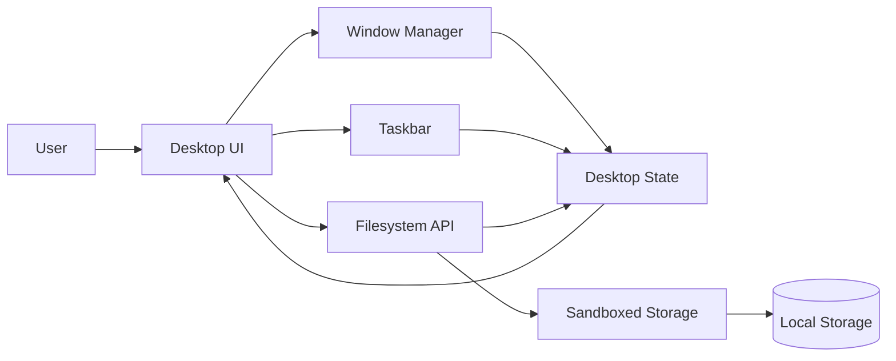

# Building a Child-Safe Desktop Operating System in the Browser

## Why Desktop4Kids exists

Desktop4Kids did not start as a technical experiment.

It started as a parenting problem.

As a father, I want my children to grow up digitally literate. Technology is not optional anymore. Knowing how to use a computer is as foundational as reading or math.

But every time I sat my kids in front of a computer, I ran into the same issue most parents quietly face:

The modern internet is not designed for children.

Even with parental controls, filtered browsers, and “safe mode” toggles, the underlying system still assumes adult users. One misclick. One external link. One autoplay video. And suddenly you are in damage-control mode.

I did not want to constantly supervise every second.

I wanted an environment that was safe by design.

Not a single-purpose app.
Not a tablet game.
Not a locked-down website.

A real desktop experience.

Something that teaches children how computers actually work — while keeping them inside a controlled and intentional system.

Desktop4Kids began as a solution for my own family.

---

## Why a desktop, not just a website

Most educational platforms focus on content delivery.

They teach math.
They teach reading.
They teach facts.

But they do not teach computing.

A desktop environment teaches things that isolated apps do not:

- File organization  
- Application switching  
- Multi-tasking  
- Cause and effect  
- Digital responsibility  
- Ownership of digital space  

I want my children to be comfortable using a computer — not just consuming content inside one.

That required building something closer to an operating system than a traditional web app.

---

## Defining the non-negotiables

Before writing code, I defined constraints based on safety and trust — not convenience.

Non-negotiables:

- **Offline-first**: No accounts, no servers, no cloud dependency  
- **No unrestricted internet access**: External content must be curated  
- **Child-proof sessions**: Children cannot exit or escape without a parent  
- **Multi-user support**: Separate parent and child profiles  
- **Persistent state**: The desktop must feel stable and predictable  

These constraints shaped every architectural decision.

When safety is a requirement, architecture changes.

You do not bolt protection on at the end.
You design around it from the beginning.

---

## High-level architecture

The goal was simple:

Make the system feel like an operating system, while remaining fully contained inside the browser.

No external dependencies.
No remote execution.
No hidden backdoors.

Everything lives locally.

---

## The desktop as a controlled environment

Early in development, I stopped thinking of the desktop as a set of pages.

It became a state machine.

At any moment, the system knows:

- Which user is logged in  
- Which applications are running  
- Which window is focused  
- What permissions are active  
- What actions are restricted  

There is a centralized controller that enforces rules consistently.

This is important.

If rules are scattered across individual apps, gaps appear.

The key insight was this:

> Safety must be structural, not conditional.

If an application cannot break the rules, it does not matter how it behaves.

---

## Window management as a boundary

Every application runs inside a managed window owned by the system — not by the app.

The window manager controls:

- Focus  
- Z-index stacking  
- Dragging and resizing  
- Minimize and restore  
- Taskbar presence  

Applications do not control their container.

They cannot open arbitrary URLs.
They cannot escape to system-level controls.
They cannot manipulate global state.

This mirrors real operating system principles.

Applications are guests.
The OS is authority.

---

## Filesystem abstraction

Children need to understand files.

They need to create them, rename them, move them, delete them.

But they should never touch the real machine.

Desktop4Kids uses a sandboxed filesystem abstraction that supports:

- File creation and editing  
- Folder structure  
- Rename and delete  
- Recoverable trash  
- Per-user isolation  

All data is scoped to the active profile and stored locally.

From a child’s perspective, it feels real.

From a parent’s perspective, it is contained.

Mistakes are reversible.
Nothing leaves the sandbox.

---

## Parent accounts vs child accounts

Strict separation between parent and child roles is foundational.

Parent accounts can:

- Create and manage child profiles  
- Configure access to applications  
- Customize themes and layout  
- Exit or shut down the system  

Child accounts:

- Cannot close the OS  
- Cannot access system settings  
- Cannot install arbitrary content  
- Can only use approved tools  

This is not about restriction for control’s sake.

It is about developmental pacing.

Children need room to explore — but inside boundaries.

---

## Built-in learning tools

Desktop4Kids includes intentionally simple, focused applications:

- File Explorer  
- Media Viewer  
- Drawing and Paint tools  
- Reading library and audiobooks  
- Educational games  
- World maps and exploration tools  
- A growing learning management system  

The goal is not feature overload.

It is exploration within structure.

Children should feel capable, not overwhelmed.

---

## Lessons learned

Building Desktop4Kids reinforced principles I believe in beyond software:

- Structure builds confidence  
- Predictability reduces anxiety  
- Invisible safety is more effective than visible restriction  
- Simplicity scales better than complexity  

Children do not need endless features.

They need stable environments.

As both a Soldier and a father, I believe systems should protect the people inside them without requiring constant vigilance.

Desktop4Kids reflects that mindset.

---

## Closing thoughts

Desktop4Kids is not just code.

It is a response to a gap I experienced firsthand.

I wanted something better for my own children — something that teaches real computing skills while keeping them safe without constant supervision.

Technology is not the enemy.

Unstructured access is.

Desktop4Kids is my answer to that problem:

A calm, predictable, secure digital environment where children can learn how computers actually work.

> Good systems protect users without making them feel restricted.