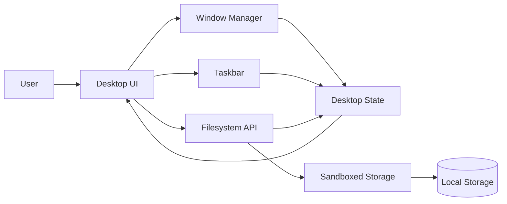

# Designing a Browser-Based Desktop Operating System

## Why build a desktop OS in the browser?

Most web applications are built around pages.

Routes.
Views.
Transitions.
Unmount and re-render.

That model works well for content-driven experiences.

It breaks down when you want to simulate a persistent environment — something that behaves more like an operating system than a website.

Desktop4Kids OS started as a question:

*Could a browser-based environment feel like a real desktop?*

Not a novelty.
Not a parody.
Not a draggable-div demo.

A structured, predictable, extensible system.

What followed became a multi-year exploration into:

- UI systems  
- Window orchestration  
- State isolation  
- Offline-first architecture  
- User safety boundaries  

The challenge was not making it look like a desktop.

The challenge was making it behave like one.

---

## Defining the constraints

Before writing code, I defined architectural constraints.

Not preferences. Constraints.

- **Offline-first**: No backend dependency, no cloud requirement  
- **Sandboxed**: Filesystem access must be controlled and scoped  
- **Multi-window**: Applications must coexist without interfering  
- **State persistence**: Layout and data must survive reloads  
- **Child-safe by default**: No external network access  

These constraints immediately eliminated common frontend assumptions.

No remote APIs.
No server validation loops.
No “just reload the page” fallback.

Everything had to be self-contained.

---

## High-level architecture

The system revolves around a centralized desktop state controller.

Everything else subscribes to it.

The browser becomes the runtime.
The desktop becomes the environment.

---

## The desktop as a state machine

A critical design decision was rejecting the page model entirely.

The desktop is not a route.
It is not a component.
It is not a page.

It is a state machine.

At any moment, the system must know:

- Which apps are running  
- Which window has focus  
- Z-index stacking order  
- Window size and position  
- Taskbar state  
- Active user profile  

This led to a thin orchestration layer responsible for:

- State updates  
- Event routing  
- Cross-system coordination  

No framework.
No reactive library.
Just controlled state transitions.

The key realization:

> Windows are not UI components. They are stateful entities with lifecycles.

Once that shift happened, architecture clarified.

---

## Window management as system authority

Each application runs inside a managed window container.

The window manager owns:

- Focus logic  
- Drag and resize behavior  
- Z-index stacking  
- Minimize / maximize transitions  
- Taskbar registration  

Applications do not manage their own chrome.

They request rendering.
The OS renders the container.

This separation prevents fragmentation and enforces consistent behavior.

It mirrors real operating system design:

Applications operate inside boundaries.
The OS controls the boundaries.

---

## Filesystem abstraction

A core requirement was a filesystem that felt real without exposing real access.

The solution was a sandboxed filesystem API layered over local storage.

Applications interact with a constrained interface:

- Read  
- Write  
- Rename  
- Delete  
- Restore from trash  

Every operation is:

- Scoped to the active user  
- Validated at the API boundary  
- Contained within a virtual directory structure  

The filesystem is a model, not the DOM.
The API is the enforcement point.

From an app’s perspective, it behaves like a real filesystem.

From a safety perspective, it is fully contained.

---

## Multi-window coexistence

Most web apps assume isolation.

A desktop assumes concurrency.

Multiple applications must:

- Stay mounted  
- Maintain independent state  
- Preserve position  
- Respond to focus changes  
- Update taskbar presence  

This required strict separation between:

- App state  
- Window state  
- Desktop state  

Apps cannot manipulate global z-index directly.
They cannot hijack focus.
They cannot bypass the window manager.

Concurrency without chaos requires ownership boundaries.

---

## Built-in applications as system validation

Desktop4Kids OS ships with intentionally simple applications:

- File Explorer  
- Media Center  
- Notepad  
- Calculator  
- Paint  
- Settings  
- Trash  

Each application serves as a system test.

If the architecture is correct:

- Focus works everywhere  
- File operations behave consistently  
- Windows persist across reloads  
- Themes propagate globally  

The goal was not feature depth.

It was architectural validation.

If the system holds under multiple app types, it scales.

---

## Designing for extensibility

Long-term, the desktop must behave like a platform.

That influenced early decisions:

- App registration system  
- Shared UI primitives  
- Global theme propagation  
- Stable internal APIs  
- Consistent permission boundaries  

An application should be able to register itself with the OS without modifying core logic.

That requirement forces discipline.

Platforms fail when boundaries blur.

---

## Offline-first as architectural discipline

Offline-first design simplifies more than it complicates.

No external calls.
No authentication state drift.
No server reconciliation loops.

User action updates local state.
State updates UI.
Optional synchronization is secondary.

This makes behavior deterministic.

Deterministic systems are easier to debug, extend, and trust.

---

## Lessons learned

Building a desktop OS in the browser challenged common frontend assumptions.

Key takeaways:

- Not all UI fits into route-based models  
- Centralized state is powerful when constrained  
- Predictability beats clever abstraction  
- Safety must be structural  
- Constraints improve architecture  

The browser is more capable than most people assume.

The limitation is rarely the platform.

It is architectural discipline.

---

## Closing thoughts

Desktop4Kids OS continues evolving.

What began as an experiment has become a long-term platform project combining:

- UI engineering  
- Systems thinking  
- State architecture  
- Product design  

More importantly, it reinforced a core belief:

> Good software feels calm, predictable, and intentional — even when it is complex.

If complexity exists, it should be internal.

The user experience should remain stable.

That is the standard I build toward.